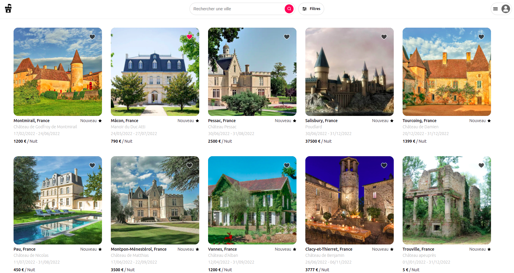
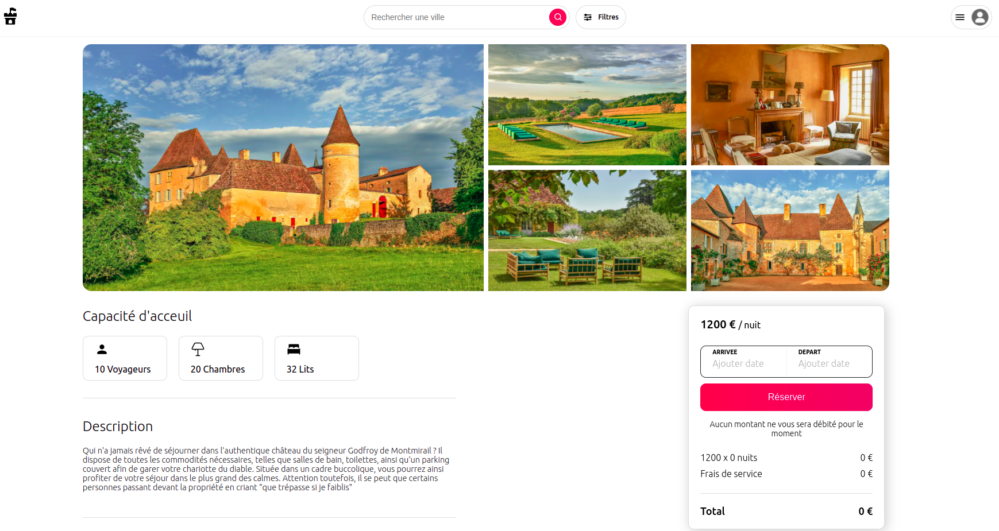
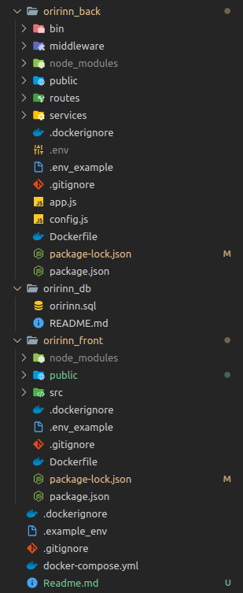
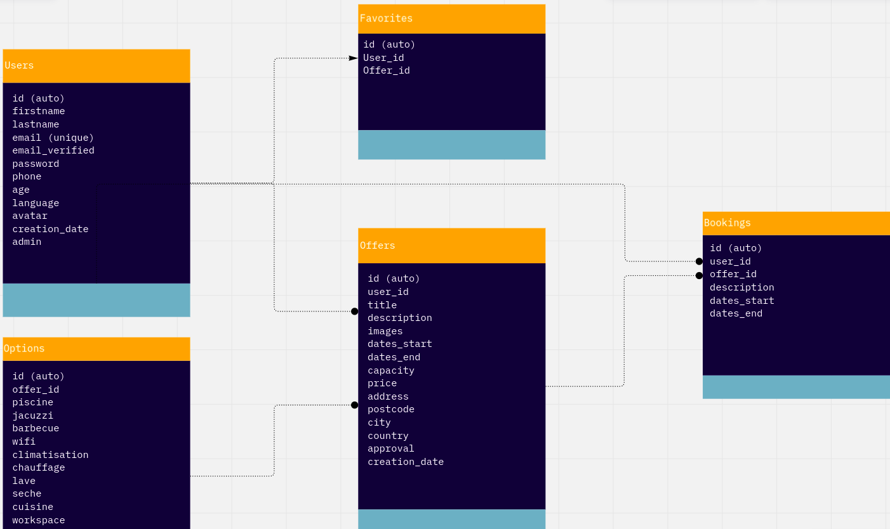

<h1 align="center" id="title">ORIR'INN</h1>

<p align="center"></p>

<p id="description">Orir'inn takes a unique approach toward lodging. Part of the “luxury economy” Orir'inn offers you someone’s castle as a place to stay instead of a poor hotel. Enjoy the life with Orrir'inn's Castle !</p>

</br>

<h2>Project Screenshots:</h2>
</br>


</br>
</br>




  </br>
  
<h2>🧐 Features</h2>
</br>

Here're some of the project's best features:
*   Authentication
*   Post Offers
*   Book Offers
*   Admin Page
*   User Profile
*   Search / Filters
*   Cool map and calendar

</br>
<h2>🛠️ Installation Steps:</h2>

</br>

<p>1. Clone repo from github :</p>
</br>

```
Repo/git
```

<p>2. Install Dependencies:</p>

```
cd oririnn_back && npm install 
```

```
cd oririnn_front && npm install
```

<p>3. Start Mysql :</p>

```
source [path to file]/oririnn.sql;
```

```
use oririnn;
```

<p>4. Start the project :</p>

```
cd oririnn_back && nodemon app.js
```

```
cd oririnn_front && npm start
```

<h2>🍰 Working tree:</h2>
</br>

  
  
</br>
  
<h2>💻 Built with</h2>
</br>

Technologies used in the project:
</br>
</br>

<a href="#"></a>
<a href="#"></a>
<a href="#"></a>
</br>
</br>
Database Organisation:
</br>
</br> 

</br>
</br>
<h2>🛡️ License:</h2>

This project is licensed under the MIT

<h2>Like our work?</h2>

For support Please Contact..

<a href="#"></a>